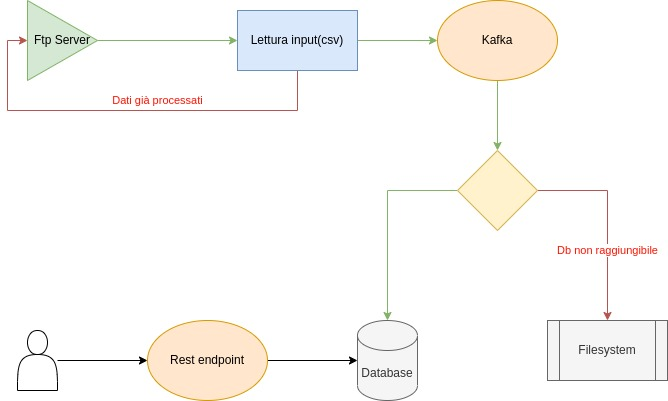

# Camel Demo

Applicazione demo per l'utilizzo di apache camel.

## Descrizione

L'applicazione legge i file con estensione csv dalla directory `input` del server ftp.<br>
I dati devono contenere i seguenti campi:

| Nome      | Descrizione                            |
|-----------|----------------------------------------|
| idPayment | L'id del pagamento                     |
| name      | Nome dell'autore del pagamento         |
| surname   | Cognome dell'autore del pagamento      |
| processed | Se il pagamento è da processare o meno |

**NB: non utilizzare l'intestazione nel csv.**

I dati con `processed` true verranno inviati su una coda kafka.<br>
Gli altri verrano inseriti in un csv dentro la directory `output` del server ftp.
Il consumatore che leggerà dalla coda inserirà questi dati nella tabella `PAYMENT` del database.<br>
In caso di `idPayment` già presente verrà segnalato tramite log il problema.<br>
In caso di altri errori (es: database non raggiungibile) verrà tentato l'inserimento dei dati per tre volte con un 
delay di un secondo, altrimenti i pagamenti non processati vengono inseriti in un csv salvato sul filesystem.<br>
Nel csv verrà indicata anche l'eccezione che ha scatenato l'errore.<br>
Inoltre viene esposto un endpoint `/payments` per ottenere i pagamenti salvati sul database.


## Flusso


## Utilizzo
```
docker-compose up -d
mvn spring-boot:run
```
## Test
```
mvn clean test
```
### Report coverage
```
mvn camel-report:route-coverage
```